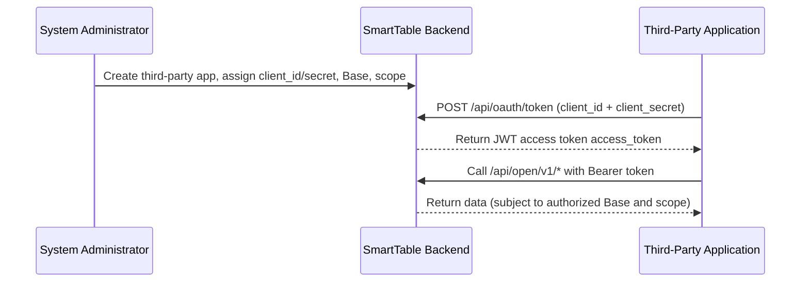

# Third-Party Application Integration (OAuth2 Client Credentials)

This document is for developers who want to call the SmartTable Open API as the application's own service account. It introduces the OAuth2 Client Credentials flow, the token endpoint, scopes, and token management.

> Use case: server-to-server (Server-to-Server) automated integration with no end user involved. If you need to access user data under user authorization, use another grant type (the current version supports **only** Client Credentials).

---

## 1. Overall Flow



The application identity represents the **application itself**, not a specific user. All writes performed through the Open API are audited under the application ID.

---

## 2. Creating a Third-Party Application (Admin)

An administrator creates the application in the backend "Third-Party Applications" page (or by calling the management API). The system generates:

- `client_id`: unique application identifier (e.g. `oa_xxxx`), safe to expose.
- `client_secret`: application secret (e.g. `os_xxxx`), returned **only once** at creation/reset; the system stores only its hash. Store it securely.

Configurable at creation:

- **Authorized Base scope (allowed_bases)**: the allow-list of Bases the application may access.
- **Permission scope (scopes)**: the set of capabilities granted to the application.
- **Status (is_active)**: when disabled, all tokens of the application become invalid immediately.

Resetting the secret invalidates the old secret immediately; update your application configuration with the new secret returned.

---

## 3. Obtaining an Access Token

### Endpoint

```
POST /api/oauth/token
```

### Request Parameters (form or JSON)

| Parameter | Required | Description |
| --- | --- | --- |
| `grant_type` | Yes | Fixed to `client_credentials` |
| `client_id` | Yes | The application's client_id |
| `client_secret` | Yes | The application's client_secret |
| `scope` | No | Space-separated scope, must be a subset of the granted scope; if omitted, all granted scope is used |

**HTTP Basic Auth** is also supported: `Authorization: Basic base64(client_id:client_secret)`; in that case, the request body does not need to carry `client_id` / `client_secret`.

### Request Examples

Using form + Basic Auth:

```bash
curl -X POST "https://your-domain/api/oauth/token" \
  -u "oa_your_client_id:os_your_client_secret" \
  -d "grant_type=client_credentials" \
  -d "scope=record:read record:write"
```

Using JSON request body:

```bash
curl -X POST "https://your-domain/api/oauth/token" \
  -H "Content-Type: application/json" \
  -d '{
    "grant_type": "client_credentials",
    "client_id": "oa_your_client_id",
    "client_secret": "os_your_client_secret",
    "scope": "record:read record:write"
  }'
```

### Success Response (OAuth2 standard format)

```json
{
  "access_token": "eyJhbGciOiJIUzI1NiIsInR5cCI6IkpXVCJ9...",
  "token_type": "Bearer",
  "expires_in": 7200,
  "scope": "record:read record:write"
}
```

| Field | Description |
| --- | --- |
| `access_token` | JWT access token, default validity 7200 seconds (2 hours) |
| `token_type` | Fixed to `Bearer` |
| `expires_in` | Remaining valid seconds |
| `scope` | The scope actually granted (space-separated) |

> The token is a self-contained JWT carrying claims: `client_id`, `app_id`, `scope`, `sub` (= app_id), `token_type=app`. The server verifies it via local signature validation + Redis blacklist, without querying the database each time.

### Error Response

```json
{
  "error": "invalid_client",
  "error_description": "client_id or client_secret is invalid",
  "request_id": "req_xxx"
}
```

| error | HTTP | Meaning |
| --- | --- | --- |
| `unsupported_grant_type` | 400 | Only `client_credentials` is supported |
| `invalid_client` | 401 | `client_id` / `client_secret` is wrong, or the application is disabled |
| `invalid_scope` | 403 | Requested scope exceeds the granted scope |

---

## 4. Permission Scope

| Scope | Meaning | Corresponding Open API |
| --- | --- | --- |
| `base:read` | Read authorized Base list and details | `GET /bases` |
| `table:read` | Read table structure | `GET /bases/{id}/tables` |
| `field:read` | Read field structure | `GET /bases/{id}/tables/{id}/fields` |
| `record:read` | Read / query records | `GET .../records` |
| `record:write` | Create / update / delete records | `POST/PUT/DELETE .../records` |
| `table:write` | Write table structure (reserved) | Write endpoint not yet open |

> Follow the principle of least privilege: request only the scope your application actually needs. Over-privileged access returns `403`.

---

## 5. Token Revocation

- **Revoke by application**: an administrator in the backend, or by calling `POST /api/oauth/apps/{app_id}/tokens/revoke` (without `jti`), revokes all unexpired tokens of the application.
- **Revoke a single by jti**: `POST /api/oauth/apps/{app_id}/tokens/revoke` with body `{"jti": "<token_jti>"}`.
- Revocation is implemented via Redis blacklist + database `revoked` flag, taking effect immediately.
- When an application is disabled by an administrator, all of its tokens become invalid immediately.

> Every Open API request validates whether the token is in the Redis blacklist; after revocation, the next request is rejected.

---

## 6. Application Management API (Admin)

The following endpoints require an **administrator user token** (regular user JWT, `Authorization: Bearer <user_token>`), distinct from the application token of the Open API.

| Method | Path | Description |
| --- | --- | --- |
| GET | `/api/oauth/apps` | List all applications |
| POST | `/api/oauth/apps` | Create application (returns plaintext secret once) |
| GET | `/api/oauth/apps/{app_id}` | Application details |
| PUT | `/api/oauth/apps/{app_id}` | Update application configuration |
| DELETE | `/api/oauth/apps/{app_id}` | Delete application (cascading token revocation) |
| POST | `/api/oauth/apps/{app_id}/reset-secret` | Reset secret (returns new plaintext secret) |
| GET | `/api/oauth/apps/{app_id}/tokens` | View issued tokens |
| POST | `/api/oauth/apps/{app_id}/tokens/revoke` | Revoke token (optionally with jti) |
| GET | `/api/oauth/apps/{app_id}/audit` | View audit log |
| GET | `/api/oauth/bases` | List all Bases (for authorized scope selection) |

### Create Application Example

```bash
curl -X POST "https://your-domain/api/oauth/apps" \
  -H "Authorization: Bearer <admin_user_token>" \
  -H "Content-Type: application/json" \
  -d '{
    "app_name": "Data Sync Service",
    "callback_url": "https://app.example.com/callback",
    "allowed_bases": ["11111111-1111-1111-1111-111111111111"],
    "scopes": ["record:read", "record:write"]
  }'
```

Response (note `client_secret` is returned only this once):

```json
{
  "code": 0,
  "message": "Third-party application created",
  "data": {
    "id": "aaaaaaaa-...",
    "app_name": "Data Sync Service",
    "client_id": "oa_abc123...",
    "client_secret": "os_xyz...",
    "allowed_bases": ["11111111-1111-1111-1111-111111111111"],
    "scopes": ["record:read", "record:write"],
    "is_active": true
  }
}
```

---

## 7. Security Recommendations

- Store `client_secret` in server-side secret management (e.g. environment variables, KMS); **do not** write it into frontend code or commit it to a repository.
- Grant only the minimum scope and minimum Base scope the application needs.
- Rotate `client_secret` periodically for long-running services.
- Tokens have limited validity; renew before expiry; do not print `access_token` in logs.
- If a secret leak is discovered, immediately "Reset Secret" in the backend to invalidate the old secret at once.

---

## 8. FAQ

**Q: What to do when the token expires?**  
A: Call `/api/oauth/token` again with the same `client_id` / `client_secret` to obtain a new token.

**Q: Can a user token be used to call /api/open/v1?**  
A: No. The Open API only accepts application tokens with `token_type=app`; user tokens are rejected (`403`).

**Q: Can the requested scope exceed the granted scope?**  
A: No, it returns `invalid_scope` (`403`).

## Related Documents

- [Open API Reference](./open-api.md)
- [Third-Party Application Integration Examples](./oauth2-practice-examples.md)
