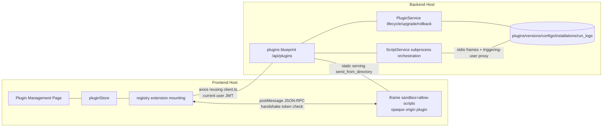

# SmartTable Plugin Architecture

>  Related: [Plugin Developer Guide](./developer-guide.html)

## 1. Overview

### 1.1 Goals

Provide SmartTable with a secure, extensible plugin system so third-party developers can build custom plugins against a clear manifest specification and API documentation, and deploy them into existing installations as packages.

### 1.2 Design References

| Reference | Borrowed ideas |
|-----------|----------------|
| Lark Base plugins | Declarative manifest registration, iframe sandbox execution, host-provided SDK, permission grant at install time |
| SeaTable Scripts | Backend scripts for batch table operations, run history/logs, restricted API proxy |

### 1.3 Two Plugin Types

| Type | Runs in | UI | Communication | Typical scenarios |
|------|---------|----|---------------|-------------------|
| `ui` frontend plugin | Browser iframe sandbox | Yes | postMessage JSON-RPC | Panels, toolbar buttons, record blocks |
| `script` backend plugin | Controlled server-side subprocess | No | stdio protocol frames proxy | Batch data processing, scheduled tasks (reserved) |

Both types share the same manifest specification, lifecycle model, permission model and configuration storage; they diverge only in runtime mechanics.

### 1.4 Overall Architecture



Key invariants:

1. **Plugins never hold user credentials** — all data operations are proxied and authorized by the host;
2. **Plugins are global resources** — package files are shared globally; a Base only holds install/enable relations;
3. **Effective enablement = global `status === enabled` AND `plugin_installations.enabled === true`**; the frontend registry only mounts effectively enabled plugins.

---

## 2. Manifest Specification (manifest.json)

### 2.1 Full Field Definition

```json
{
  "id": "com.example.hello-panel",
  "name": "Hello Panel",
  "description": "Sample plugin",
  "icon": "icon.png",
  "author": { "name": "Example", "url": "https://example.com" },
  "version": "1.0.0",
  "type": "ui",
  "apiVersion": "1",
  "engines": { "smarttable": ">=1.7.0 <2.0.0" },
  "entry": "main.js",
  "permissions": {
    "records": "write",
    "tables": "read",
    "storage": true,
    "network": ["api.example.com"]
  },
  "extensionPoints": [
    { "type": "toolbar-button", "title": "Hello", "icon": "Star" },
    { "type": "side-panel", "title": "Hello Panel" }
  ],
  "configSchema": {
    "type": "object",
    "properties": { "greeting": { "type": "string", "default": "Hello" } }
  },
  "script": { "timeout": 60 }
}
```

### 2.2 Field Description

| Field | Required | Type | Description |
|-------|----------|------|-------------|
| `id` | ✅ | string | Reverse-domain `com.<org>.<name>`, globally unique, immutable after install |
| `name` | ✅ | string | Display name (2-50 chars) |
| `description` | ❌ | string | Description (≤500 chars) |
| `icon` | ❌ | string | Relative path of the icon inside the package (png/svg, ≤64KB) |
| `author` | ❌ | object | Author information |
| `version` | ✅ | string | semver `MAJOR.MINOR.PATCH` |
| `type` | ✅ | enum | `ui` / `script` |
| `apiVersion` | ✅ | string | Host plugin API major version, currently `"1"` |
| `engines` | ✅ | object | Host version compatibility range (npm semver-range syntax) |
| `entry` | ✅ | string | Relative entry path: `.js` for ui, `.py` for script |
| `permissions` | ✅ | object | Object-based graded permission declaration (see 2.3) |
| `extensionPoints` | required for ui | array | UI extension point declarations (see 2.4) |
| `configSchema` | ❌ | JSON Schema | Plugin configuration structure (Draft-07 subset) |
| `script.timeout` | optional for script | number | Script timeout seconds, default 30, max 300 |

### 2.3 Permission Declaration (Object-based, Graded)

```
permissions: {
  "records": "read" | "write",     // record read/write
  "tables":  "read" | "write",     // schema read/write (write includes create/delete table)
  "storage": true,                 // plugin-owned KV storage
  "config":  true,                 // read own configuration (implicitly granted)
  "network": ["api.example.com"]   // allowlist of third-party domains reachable via the host proxy (delivered: UI via network.fetch SDK, scripts via /proxy API)
}
```

Design decision: **object-based graded** permissions instead of a flat string array (e.g. `read:records`). Rationale: fine-grained permissions (table/field scoping) can be added to the value later (e.g. `{"records": {"level": "write", "tables": ["tbl_xxx"]}}`), whereas a flat form would be a breaking change. Undeclared permission points are denied by default.

`config` is implicitly granted: reading its own configuration is a basic capability and needs no explicit declaration.

### 2.4 UI Extension Point Types (First Release)

| type | Mounted at | Behavior |
|------|-----------|----------|
| `toolbar-button` | Table view toolbar | Click opens the side panel or triggers the plugin |
| `side-panel` | Right drawer | Hosts the iframe sandbox rendering the plugin UI |
| `base-menu` | Base top extension menu | Menu item click opens the side panel |
| `record-detail-block` | Bottom block of the record detail drawer | Hosts the iframe sandbox |
| `home-menu` | Home page global extension menu | Global-scoped entry, no Base install needed (menu item click opens the side panel) |
| `dashboard-widget` | Dashboard custom widget area | Hosts the iframe sandbox rendering the plugin widget |

Extension points are registered declaratively; the host renders them from the manifest and plugins never (and cannot) manipulate host DOM directly.

> **`toolbar-button` and `side-panel` form an "entry ↔ content" pairing**: `side-panel` has no entry independent of `toolbar-button`; declare the two together (see Developer Guide §2.2). The other extension points (`base-menu` / `record-detail-block` / `home-menu` / `dashboard-widget`) each have their own independent host entry and are not subject to this constraint.

**Optional selection dependency declarations** (apply to that extension point entry):

| Field | Type | Description |
|-------|------|-------------|
| `requiresSelection` | boolean | When `true`, the host disables the entry with a hint if nothing is selected in the table; guarantees the plugin receives a non-empty `selection` |
| `maxSelection` | number(1-1000) | Maximum selected records allowed; the host disables the entry with a hint when exceeded, preventing plugins from processing huge datasets |

### 2.5 Dependency Management Scope

**Inter-plugin dependencies are not supported in the first release** (no `dependencies` field); only host version compatibility declarations (`engines` + `apiVersion`) are supported. Rationale: dependency graph resolution, cycle detection and install ordering are too heavy for the first release; host API version negotiation already covers core compatibility needs. Future path: add `dependencies: {"com.example.lib": ">=1.0.0"}` to the manifest with topological ordering at install time — no conflict with this architecture.

---

## 3. Lifecycle Management

### 3.1 State Machine

```
                 upload (zip validation passed)
                        │
                        ▼
                  [installed] ──enable──▶ [enabled]
                        ▲                    │
                        └───disable──────────┤
                                             │ N consecutive failures
                                             ▼
                                          [error] ──re-enable──▶ [enabled]
                         any state ──uninstall──▶ (deleted)
```

Global status (`plugins.status`): `installed` (installed, not enabled) / `enabled` / `disabled` / `error` (set automatically after consecutive failures, recoverable manually).

### 3.2 Operations and Permission Subjects (Two-layer RBAC)

| Operation | API | Subject | Notes |
|-----------|-----|---------|-------|
| Upload/install/upgrade/rollback/uninstall | `POST /api/plugins/upload` etc. | **System Admin** (`User.is_admin`) | Plugin packages are global resources |
| Global enable/disable | `PUT /api/plugins/<id>/status` | System Admin | Global kill switch |
| Base-level install/enable/disable | `POST/PUT /api/plugins/<id>/installations` | **Base Owner/Admin** (`BaseMember.MemberRole`) | Independent decision per Base. **Only meaningful for UI plugins**: installations exist solely for Base distribution and mounting (registry `isEffective` + sandbox loader URL check). Script runs are governed by RBAC + the global switch and do not consume installations; the management page offers no Base install entry for them |
| Config read/write | `GET/PUT /api/plugins/<id>/config` | Base Owner/Admin (base scope) / System Admin (global scope) | Validated by configSchema |
| Manual script run | `POST /api/plugins/<id>/run` | Base Editor and above (on that Base) | Proxied as the triggering user |

When the global status is `disabled`/`error`, Base-level `enabled` has no effect — the registry only mounts plugins that are "globally enabled and Base-level enabled".

**Management UI convention (implementation and product decision)**: the **UI entry points for all management operations are centralized on the global plugin management page** (`/admin/plugins`, `PluginManage.vue`) — upload, global enable/disable, **Base-level install/enable/remove** (the "Base Installation" block on each card, operating on the Base selected in the filter area), and two-level configuration (the "Config" dialog with global/base tabs). **Base editing pages provide no plugin install/management UI**; they only consume "effectively enabled" plugins (registry mounting) and the run entry. API permissions for Base Owner/Admin remain unchanged — only the UI surface is consolidated onto the management page.

### 3.3 Installation Flow

1. Upload `.stplugin.zip` (multipart);
2. Server-side extraction and validation:
   - zip path traversal protection (reject absolute paths, `..`, drive-letter prefixes);
   - zip bomb protection: total uncompressed size ≤ 50MB, file count ≤ 500, per-file compression ratio anomaly detection;
   - `manifest.json` present and validated by jsonschema;
   - `entry` file exists inside the package;
   - `version` conforms to semver;
   - `engines.smarttable` compatible with the host version (read from `version.json`);
   - `apiVersion` supported by the host;
   - extension point / permission declaration structures valid;
3. Compute the package checksum (sha256);
4. Store under `uploads/plugins/<plugin_id>/<version>/`;
5. Write `plugins` + `plugin_versions` rows with status `installed`;
6. **Enablement and distribution** (all via the plugin management page UI): global enable → pick the target Base in the "Base Installation" block and install+enable → the registry mounts the plugin on that Base page (UI extension points active / script runnable). Base/table parameters required by a UI plugin are configured by admins in the "Config" dialog under the Base scope; users simply open the plugin on the Base page.

### 3.4 Upgrade and Rollback

- **Upgrade**: uploading a higher version of the same `plugin_id` → validation passes → new version directory recorded in `plugin_versions`, `plugins.current_version` pointer updated; **all configs/installations preserved** (if configSchema is incompatible with existing configuration, the upgrade is rejected with conflict details);
- **Rollback**: `POST /api/plugins/<id>/rollback` with a retained version from `plugin_versions`, switching the `plugins.current_version` pointer; old version directories are always kept (cleaned up only on uninstall);
- **Downgrade protection**: uploading a package with a lower version is rejected (rollback uses the dedicated API, not upload).

### 3.5 Uninstall Semantics

Uninstall = global deletion: remove `plugins`, all `plugin_versions`, all `plugin_configs`, all `plugin_installations`, `plugin_run_logs` (soft delete with 30-day retention is a future option; hard delete in the first release) plus the package directory. **Disabling/upgrading does not delete data.**

---

## 4. Permission Model

### 4.1 Model Composition

```
manifest declaration (request) ──▶ grantor confirmation at install ──▶ per-request runtime check ──▶ deny + audit on violation
```

1. **Declaration**: the plugin statically declares required permissions in the manifest; runtime requests are not allowed (avoids "phishing-style" incremental escalation);
2. **Grant**: system admins see the permission summary at upload; Base Owner/Admin see it again at Base-level enablement — two independent decisions;
3. **Check**: the host bridge (frontend RPC bridge / backend stdio proxy loop) compares each method call against the manifest permissions;
4. **Deny and audit**: violations return `PERMISSION_DENIED` and are written to run/audit logs (with plugin_id, method, triggering user).

### 4.2 Permission Point to API Method Mapping

| Permission point | Frontend RPC methods | Backend script APIs |
|------------------|----------------------|---------------------|
| `records: read` | `table.getRecords`, `table.searchRecords`, `table.getRecord` | `base.list_records()`, `base.get_record()` |
| `records: write` | `record.create`, `record.update`, `record.delete`, `record.batchUpdate` | `base.create_record()`, `base.update_record()`, `base.delete_record()` |
| `tables: read` | `table.getSchema`, `table.listTables` | `base.list_tables()`, `base.get_fields()` |
| `tables: write` | `table.addField`, `table.updateField`… | `base.add_field()`… (reserved for the script side) |
| `storage` | `storage.get/set/remove` | `base.storage_get/set()` (plugin KV independent of table data) |
| `config` (implicit) | `config.get` | `base.get_config()` |
| UI capabilities (no declaration) | `ui.notify`, `ui.setPanelTitle` | — |

### 4.3 Data Operation Identity

- **UI plugins**: the host forwards requests to existing REST APIs using the **current user's** JWT — permissions are double-checked (plugin permission point + user RBAC); data the user cannot access is also inaccessible to the plugin;
- **Script plugins**: the host proxy executes as the **triggering user** (manual run = the triggering user). When scheduled execution arrives, a "plugin service identity" (degraded read-only/limited identity within the Base Owner's grant) will be added — reserved here.

### 4.4 Audit Attribution

Data changes performed by the proxy carry `via_plugin: <plugin_id>` metadata in change history/audit logs, distinguishing "human operations" from "plugin operations" so batch operations remain accountable.

---

## 5. Communication Interfaces

### 5.1 Frontend: Handshake + postMessage JSON-RPC

#### 5.1.1 Sandbox Isolation

The iframe is loaded from a **same-origin URL** `/api/plugins/<id>/versions/<version>/loader.html` but with `sandbox="allow-scripts"` (**without** `allow-same-origin`). Effects:

- iframe content gets an **opaque origin** (`origin === "null"`); even though the URL is same-origin, it cannot access host cookies, localStorage or DOM;
- `postMessage` messages that have not passed the handshake are discarded.

**Note**: because the origin is always `"null"`, **`event.origin` allowlists cannot be used for source validation** (also null when dev ports differ, e.g. 5173→5000).

#### 5.1.2 Handshake Protocol

```
Host                                    iframe plugin
  │  create iframe, generate one-time token │
  │  URL: loader.html#token=<token>         │
  │  (fragment never reaches server logs/Referer)
  │ ────────────────────────────────────▶  │
  │                                        │ parse fragment → token
  │ ◀──────── init { token } ─────────────  │
  │  verify token, bind channel by          │
  │  (source window, token)                 │
  │ ───────── initAck { sdk version, perms }▶│
  │                                        │
  │ ◀══════ rpc.request { id, method, params } ════│
  │ ══════ rpc.response { id, result | error } ▶  │
```

The token is a one-time UUID; the host keeps a `(iframeWindow → pending token)` map and destroys the token after handshake to prevent replay.

#### 5.1.3 RPC Message Format

```json
// request
{ "type": "rpc.request", "id": "req-1", "method": "table.getRecords", "params": { "tableId": "tbl_x", "page": 1 } }
// success response
{ "type": "rpc.response", "id": "req-1", "result": { "items": [], "total": 0 } }
// error response
{ "type": "rpc.response", "id": "req-1", "error": { "code": "PERMISSION_DENIED", "message": "..." } }
```

Error codes: `PERMISSION_DENIED` / `NOT_FOUND` / `VALIDATION_ERROR` / `RATE_LIMITED` / `MESSAGE_TOO_LARGE` / `INTERNAL_ERROR` / `API_VERSION_MISMATCH`.

#### 5.1.4 Protections

- **Rate limit**: 50 req/s per plugin instance; exceeding returns `RATE_LIMITED`;
- **Message size**: single postMessage ≤ 256KB;
- **Data requests proxied by the host**: the host bridge calls `api-surface` (reusing frontend services/`client.ts`); plugins never issue HTTP requests directly (they have no token);
- **loader.html generated dynamically by a backend static route**: injects `window.SmartTableSDK` (handshake, RPC client wrapper, `sdk.ready(callback)`); plugin JS is a zero-build IIFE.

#### 5.1.5 Event Subscription (Reserved)

The protocol reserves `rpc.subscribe(event)` / `rpc.unsubscribe(event)` semantics (e.g. `data.recordsChanged`), forwarded through the existing WebSocket realtime pipeline. **Not implemented in the first release**; documented so third parties do not hack around it with polling.

### 5.2 Backend: Script Sandbox stdio Protocol Frames

#### 5.2.1 Frame Format

Each subprocess stdout line is one JSON frame; protocol frames are separated from user output:

```
{"__rpc__": "call", "id": "c1", "method": "base.list_records", "params": {...}}   ← script→host (proxy call)
{"__rpc__": "result", "id": "c1", "result": {...}}                                ← host→script (via stdin)
{"__rpc__": "log", "message": "processed 100 records"}                            ← script log (print captured)
{"__rpc__": "done", "status": "success", "result": {...}}                         ← script finished
```

Non-protocol output (whatever the script writes to stdout) is captured by the runner and wrapped into `log` frames so the protocol channel stays clean.

#### 5.2.2 Restricted Runtime

Built on and extending the existing `app/script_runner/python_runner.py`:

- **Restricted builtins**: `open`/`exec`/`eval`/`__import__`/`compile`/`globals`/`locals`/`vars`/`input`/`breakpoint`/`exit`/`quit` removed;
- **Module allowlist**: `json`/`re`/`math`/`datetime`/`decimal`/`collections`/`itertools`/`hashlib`/`base64`/`uuid`/`statistics`/`time` (time reading only);
- **Injected proxy object**: `base` (restricted table API of the current Base) — each method call is sent to the host as a stdout frame; the host executes it in a Flask app context as the **triggering user** (reusing existing services + permission checks) and returns the result via stdin;
- **print capture**: `sys.stdout` is redirected so print output becomes `log` frames.

#### 5.2.3 Security Boundaries (Honest Statement)

Restricted builtins + import allowlist is **"controlled execution", not a strong sandbox**: Python offers escape surfaces at the language level (e.g. the `().__class__.__bases__` chain). Defense in depth:

1. Subprocess isolation (crashes/timeouts do not affect the host);
2. Timeout (default 30s, declarable via manifest, capped at 300s) kills the process;
3. Output size limits (result ≤ 1MB, logs truncated, reusing existing `script_execution_service` constants);
4. Concurrency cap on subprocesses (≤ CPU cores; queue or reject beyond that);
5. **Production recommendation**: run backend subprocesses as a low-privilege OS user (documented in the ops guide);
6. Scripts have no network capability (no network libraries in the allowlist).

#### 5.2.4 Error Isolation

- A single failed run only records a `plugin_run_logs` entry (traceback stored truncated, following the existing log-masking rules);
- N consecutive failures (default 5) automatically set the global `error` status; the frontend offers disable/retry;
- The host-side proxy loop runs on a dedicated thread; exceptions do not affect HTTP request handling.

### 5.3 REST Management APIs (/api/plugins)

| Method | Path | Permission | Notes |
|--------|------|------------|-------|
| POST | `/api/plugins/upload` | System Admin | Upload/install/upgrade zip |
| GET | `/api/plugins` | Logged-in user | Plugin list (with Base-level status) |
| GET | `/api/plugins/<id>` | Logged-in user | Detail (with version history) |
| PUT | `/api/plugins/<id>/status` | System Admin | Global enable/disable/restore |
| POST | `/api/plugins/<id>/rollback` | System Admin | Roll back to a specific version |
| DELETE | `/api/plugins/<id>` | System Admin | Uninstall |
| GET | `/api/plugins/<id>/versions` | Logged-in user | Version list |
| GET/PUT | `/api/plugins/<id>/config` | See 3.2 | Config read/write (scope parameter) |
| GET | `/api/plugins/<id>/installations` | Base member | Base-level installation status |
| POST/PUT/DELETE | `/api/plugins/<id>/installations` | Base Owner/Admin | Base-level install/enable/remove (**UI plugins only**: POST/PUT return 400 `PLUGIN_TYPE_NOT_INSTALLABLE` for script plugins; DELETE remains for cleaning up existing relations) |
| POST | `/api/plugins/<id>/run` | Base Editor+ | Manual script run |
| GET | `/api/plugins/<id>/run-logs` | Base Owner/Admin | Run logs |
| GET | `/api/plugins/<id>/versions/<v>/loader.html` | Logged-in user (session) | UI plugin sandbox loader |
| GET | `/api/plugins/<id>/versions/<v>/files/<path>` | Logged-in user (session) | Plugin static assets (send_from_directory, traversal-safe) |

REST paths and static file paths are explicitly distinguished by the `versions/<v>/files/` prefix to avoid Flask route ambiguity.

### 5.4 Sandbox Render Runtime (vendor)

Plugin UIs may be written with a standard frontend framework. The host injects a **same-origin hosted** render runtime in the loader so plugins need not inline a framework or depend on the internet:

| Runtime | File | Injection | Purpose |
|---------|------|-----------|---------|
| Vue 3 | `vue.global.prod.js` (with template compiler) | loader loads `vendor/vue.global.prod.js` before the plugin entry script | plugins can use `Vue.createApp({ template })` |

Key points:

1. **Same-origin + offline capable**: vendor assets are hosted statically by the backend (`app/plugins_sandbox/vendor/`), no CDN, no `permissions.network` needed — works on intranets/offline;
2. **Security boundary**: filename allowlist (only `vue.global.js` / `vue.global.prod.js`) plus `send_from_directory` traversal protection; vendor assets are read-only static resources, not part of the handshake authentication;
3. **Zero build**: the plugin remains a single entry file with the template written as a string — no bundler required;
4. **CSP**: the production CSP `script-src` already includes `'unsafe-eval'` as required by the Vue template compiler (runtime compilation);
5. **Isolation unchanged**: the injected Vue lives only inside the opaque-origin iframe, fully isolated from the host page's Vue instance — no shared DOM/state;
6. **Extensible**: to add React or other runtimes later, follow the same "allowlisted vendor + loader injection" approach — the plugin contract stays the same.

### 5.5 Table Selection Channel (selection)

**Goal**: after selecting records in the table, clicking a plugin button hands the selected records to the plugin for processing.

**Data channel (host → plugin)**

| Stage | Implementation | Location |
|-------|----------------|----------|
| Selection source | A table implements `SelectionProvider { getSelection(): SelectionSummary }` and registers it; VTable merges "row selection + checkbox selection" with dedup, header select-all maps to all rows of the page | `VTableView.getSelection()` → registered in `Base.vue` |
| Entry availability | The page reports the selection summary (IDs + count only) on the `records-select` event; the registry keeps `selection`; the toolbar computes button disabled state and hints from `requiresSelection` / `maxSelection` | `registry.setSelection` / `PluginToolbar` |
| Snapshot creation | A snapshot is created **once** when the plugin is opened (RPC bridge creation) and written into the bridge context; it is not pushed on selection changes | `PluginSandbox` → `buildSelectionSnapshot()` |
| Plugin read | `ui.getContext()` returns `selection`, or `selection.get()` alone | `api-surface` |

**Snapshot structure**: `{ recordIds: string[], total: number, truncated: boolean, selectAll: boolean, scope: "page" \| "view", at: number }`

**Constraints and integrity**

1. **IDs only**: record content is fetched on demand via `table.getRecord`, keeping bulk data out of the sandbox context and the postMessage channel;
2. **Cap of 1000**: beyond that it is truncated with `truncated` set (`total` keeps the real value); both host and plugin hint the user to narrow the selection;
3. **Snapshot on open**: no change push; selection changes require reopening the plugin (predictable, no event storms). If realtime behavior is needed later, a `selection.change` event can be added without breaking the contract;
4. **Stale cleanup**: invalid IDs are removed after refresh/delete; the selection is cleared when switching tables to avoid cross-table leakage;
5. **Permissions**: selection exposes IDs only; real reads/writes still go through the existing two-layer check (manifest permission point + user RBAC), so selection data is not a privilege escalation path.

**Extensibility and compatibility**

- Host-side table adaptation is decoupled through the `SelectionProvider` interface: VTable is integrated; the native table or other component libraries only need to implement and register the same interface;
- Plugins depend only on the global `SmartTableSDK` (postMessage + Promise) and are not tied to any frontend framework — Vue / React / vanilla JS work identically;
- Extension point declarations (`requiresSelection` / `maxSelection`) are validated by the backend manifest schema; invalid declarations are rejected at install time.

---

## 6. Plugin Configuration Storage

### 6.1 Two-level Scopes

| Scope | Storage | Write permission | Purpose |
|-------|---------|------------------|---------|
| `global` | `plugin_configs(scope=global)` | System Admin | Global defaults |
| `base` | `plugin_configs(scope=base, base_id=...)` | Base Owner/Admin | Base overrides (UI: the "Config" dialog base tab on the plugin management page, maintained per selected Base) |

Read rule: Base-level configuration is deep-merged over the global level (Base keys override same-named global keys).

### 6.2 Validation and Migration

- Writes are validated against the manifest `configSchema` (JSON Schema Draft-07 subset);
- **Preserved on upgrade**: configs are not deleted across versions; if a new version's configSchema is incompatible with existing configuration (validation fails), the upgrade is rejected with conflict details.

### 6.3 Plugin-owned KV Storage

The `storage` permission grants the plugin an independent KV store (a scope extension of `plugin_configs` or a dedicated table; in the first release under the `plugin_storage` key space, key length ≤ 128, single value ≤ 64KB, ≤ 1MB per plugin), isolated from host data.

---

## 7. Data Model (Alembic Migration)

```
plugins              global plugin records
├── plugin_versions  version history (upgrade/rollback support)
├── plugin_configs   two-level config + plugin KV
├── plugin_installations  Base-level install/enable relations
└── plugin_run_logs  script run records
```

| Table | Key fields |
|-------|-----------|
| `plugins` | plugin_id(PK, string), name, description, icon, type, status, current_version, manifest(JSON), engines_text, created_at, updated_at |
| `plugin_versions` | id(PK), plugin_id(FK), version, package_path, checksum, installed_at |
| `plugin_configs` | id(PK), plugin_id(FK), scope(global/base/kv), base_id(nullable FK), config_key, config(JSON), updated_by, updated_at |
| `plugin_installations` | id(PK), plugin_id(FK), base_id(FK), enabled, installed_by, installed_at; UNIQUE(plugin_id, base_id) |
| `plugin_run_logs` | id(PK), plugin_id(FK), base_id(FK), status, duration_ms, triggered_by, output(truncated), error_summary, traceback(truncated), created_at |

---

## 8. Error Isolation and Stability

| Layer | Mechanism |
|-------|-----------|
| Frontend plugin | iframe load failure / heartbeat timeout (30s no response) only destroys that plugin's mount point and notifies the user; the host page is unaffected |
| Frontend RPC | Rate limiting + message size limits + unknown message discard |
| Backend script | Subprocess timeout kill; a single failure only creates a RunLog; N consecutive failures set `error` |
| Backend host | Proxy loop on a dedicated thread + Flask app context; proxy exceptions return `INTERNAL_ERROR` to the script |
| Resources | Subprocess concurrency cap; extraction size/file count caps; RunLog/output truncation; log masking |
| Host API evolution | `apiVersion` negotiation + `engines` range check; incompatible plugins are rejected at install |

---

## 9. Version Management

1. **Plugin version**: semver; `plugin_versions` retains full history for rollback;
2. **Host version compatibility**: the `engines.smarttable` range (host version read from `version.json`), checked at install/upgrade; if existing plugins become incompatible after a host upgrade they are set to `disabled` with a notice (reserved: batch validation task at startup);
3. **SDK/API version**: `apiVersion` major-version negotiation; the host supports multiple versions side by side (starting with v1); breaking changes bump the major;
4. **Downgrade protection**: uploading a lower version is rejected; rollback uses the dedicated API.

---

## 10. Distribution and Marketplace (Reserved)

The first release only supports uploading `.stplugin.zip` packages. The marketplace protocol is reserved:

```json
// marketplace.json (market index, versioned static file on a CDN)
{
  "schemaVersion": 1,
  "updatedAt": "2026-09-07T00:00:00Z",
  "plugins": [
    {
      "id": "com.example.hello-panel",
      "name": "Hello Panel",
      "latestVersion": "1.2.0",
      "versions": {
        "1.2.0": { "url": "https://market.example.com/pkgs/hello-panel-1.2.0.stplugin.zip",
                    "sha256": "...", "publishedAt": "..." }
      },
      "publisher": { "id": "example", "verified": true },
      "signature": "<publisher signature over the package sha256; the host verifies it with a built-in public key>"
    }
  ]
}
```

When the marketplace is added: the host adds a "Browse Marketplace" page → fetch the index → download the package → **reuse the same upload validation pipeline** (zip protection / manifest validation / engines check) + signature verification → install. The install pipeline is fully reused; the marketplace is merely a new "package source".

---

## 11. Implementation Phases

| Phase | Scope |
|-------|-------|
| P1 (this release) | Manifest specification, lifecycle APIs, two-layer RBAC, frontend iframe sandbox + handshake RPC, backend script sandbox, two-level config, management page skeleton, two sample plugins, developer guide; **full extension points delivered** (incl. home menu `home-menu`, dashboard widget `dashboard-widget`), **in-package static assets (assets) and custom backend endpoints (endpoints)**, **third-party network proxy** (UI via `network.fetch` SDK, scripts via `/proxy` API, with SSRF protection) |
| P2 | Event subscription (rpc.subscribe), scheduled script triggers and plugin service identity |
| P3 | Marketplace (index protocol implementation + signature verification + marketplace page), inter-plugin dependencies |

---

## 12. Security Design Checklist

- [x] iframe opaque origin isolation (sandbox=allow-scripts, no allow-same-origin)
- [x] RPC handshake token (one-time, passed via URL fragment, replay-proof)
- [x] Per-request permission checks + deny by default
- [x] Plugins never hold user credentials
- [x] zip path traversal + zip bomb protection
- [x] Static serving with send_from_directory traversal protection
- [x] RPC rate / message size limits
- [x] Script timeout / output / concurrency limits
- [x] Audit attribution (via_plugin metadata)
- [x] Log masking (reusing existing rules)
- [ ] Production recommendation: run subprocesses as a low-privilege OS user (ops guide)
- [ ] Not covered in the first release: plugin package signing (introduced with the marketplace)
