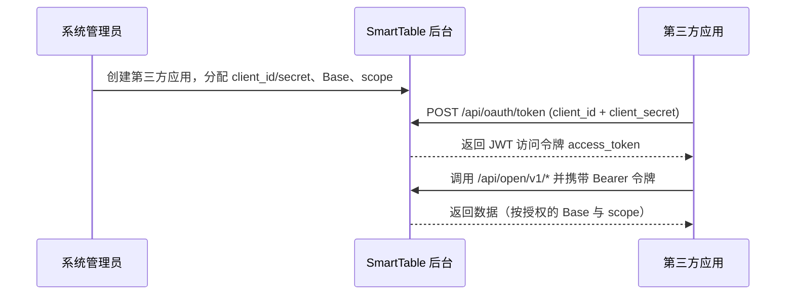

# 第三方应用接入（OAuth2 客户端凭证模式）

本文档面向希望以「应用自身服务账号」身份调用 SmartTable 开放 API 的开发者，介绍 OAuth2 Client Credentials 接入流程、令牌端点、权限范围（scope）与令牌管理。

> 适用场景：服务端到服务端（Server-to-Server）的自动化集成，没有终端用户参与。如果需要在用户授权下访问用户数据，请使用其他授权模式（当前版本**仅支持** Client Credentials）。

---

## 1. 总体流程



应用身份代表「应用自身」，而非某个具体用户。所有通过开放 API 进行的写操作的审计记录均以应用 ID 标记。

---

## 2. 创建第三方应用（管理员操作）

管理员在后台「第三方应用」页面（或调用管理 API）创建应用，系统将生成：

- `client_id`：应用唯一标识（形如 `oa_xxxx`），可安全暴露。
- `client_secret`：应用密钥（形如 `os_xxxx`），**仅创建/重置时返回一次**，系统只保存其哈希值。请妥善存储。

创建时可配置：

- **授权 Base 范围（allowed_bases）**：应用可访问的 Base 白名单。
- **权限范围（scopes）**：应用被授予的能力集合。
- **状态（is_active）**：停用后该应用所有令牌立即失效。

重置密钥会使旧密钥立即失效，请使用返回的新密钥更新您的应用配置。

---

## 3. 获取访问令牌

### 端点

```
POST /api/oauth/token
```

### 请求参数（表单或 JSON）

| 参数 | 必填 | 说明 |
| --- | --- | --- |
| `grant_type` | 是 | 固定为 `client_credentials` |
| `client_id` | 是 | 应用的 client_id |
| `client_secret` | 是 | 应用的 client_secret |
| `scope` | 否 | 空格分隔的 scope，必须是应用被授予 scope 的子集；省略则使用授予的全部 scope |

也支持 **HTTP Basic Auth**：`Authorization: Basic base64(client_id:client_secret)`，此时请求体无需再传 `client_id` / `client_secret`。

### 请求示例

使用表单 + Basic Auth：

```bash
curl -X POST "https://your-domain/api/oauth/token" \
  -u "oa_your_client_id:os_your_client_secret" \
  -d "grant_type=client_credentials" \
  -d "scope=record:read record:write"
```

使用 JSON 请求体：

```bash
curl -X POST "https://your-domain/api/oauth/token" \
  -H "Content-Type: application/json" \
  -d '{
    "grant_type": "client_credentials",
    "client_id": "oa_your_client_id",
    "client_secret": "os_your_client_secret",
    "scope": "record:read record:write"
  }'
```

### 成功响应（OAuth2 标准格式）

```json
{
  "access_token": "eyJhbGciOiJIUzI1NiIsInR5cCI6IkpXVCJ9...",
  "token_type": "Bearer",
  "expires_in": 7200,
  "scope": "record:read record:write"
}
```

| 字段 | 说明 |
| --- | --- |
| `access_token` | JWT 访问令牌，默认有效期 7200 秒（2 小时） |
| `token_type` | 固定为 `Bearer` |
| `expires_in` | 剩余有效秒数 |
| `scope` | 实际授予的 scope（空格分隔） |

> 令牌为自包含 JWT，包含声明：`client_id`、`app_id`、`scope`、`sub`（= app_id）、`token_type=app`。服务端通过本地验签 + Redis 黑名单完成校验，无需每次查询数据库。

### 错误响应

```json
{
  "error": "invalid_client",
  "error_description": "client_id 或 client_secret 无效",
  "request_id": "req_xxx"
}
```

| error | HTTP | 含义 |
| --- | --- | --- |
| `unsupported_grant_type` | 400 | 仅支持 `client_credentials` |
| `invalid_client` | 401 | `client_id` / `client_secret` 错误，或应用已停用 |
| `invalid_scope` | 403 | 请求的 scope 超出应用被授予的范围 |

---

## 4. 权限范围（Scope）

| Scope | 含义 | 对应开放 API |
| --- | --- | --- |
| `base:read` | 读取授权 Base 列表与详情 | `GET /bases` |
| `table:read` | 读取表结构 | `GET /bases/{id}/tables` |
| `field:read` | 读取字段结构 | `GET /bases/{id}/tables/{id}/fields` |
| `record:read` | 读取 / 查询记录 | `GET .../records` |
| `record:write` | 创建 / 更新 / 删除记录 | `POST/PUT/DELETE .../records` |
| `table:write` | 写入表结构（预留） | 暂未开放写入端点 |

> 遵循最小权限原则：仅申请应用实际需要的 scope。越权访问将返回 `403`。

---

## 5. 令牌撤销

- **按应用撤销**：管理员在后台或调用 `POST /api/oauth/apps/{app_id}/tokens/revoke`（不带 `jti`）撤销该应用所有未过期令牌。
- **按 jti 撤销单个**：`POST /api/oauth/apps/{app_id}/tokens/revoke` 请求体携带 `{"jti": "<token_jti>"}`。
- 撤销通过 Redis 黑名单 + 数据库 `revoked` 标志实现，即时生效。
- 应用被管理员停用后，其所有令牌立即失效。

> 开放 API 每次请求都会校验令牌是否在 Redis 黑名单中；撤销后下一次请求即被拒绝。

---

## 6. 应用管理 API（管理员）

以下端点需**管理员用户令牌**（普通用户 JWT，`Authorization: Bearer <user_token>`），与开放 API 的应用令牌区分。

| 方法 | 路径 | 说明 |
| --- | --- | --- |
| GET | `/api/oauth/apps` | 列出全部应用 |
| POST | `/api/oauth/apps` | 创建应用（返回明文 secret 一次） |
| GET | `/api/oauth/apps/{app_id}` | 应用详情 |
| PUT | `/api/oauth/apps/{app_id}` | 更新应用配置 |
| DELETE | `/api/oauth/apps/{app_id}` | 删除应用（级联撤销令牌） |
| POST | `/api/oauth/apps/{app_id}/reset-secret` | 重置密钥（返回新明文 secret） |
| GET | `/api/oauth/apps/{app_id}/tokens` | 查看已签发令牌 |
| POST | `/api/oauth/apps/{app_id}/tokens/revoke` | 撤销令牌（可指定 jti） |
| GET | `/api/oauth/apps/{app_id}/audit` | 查看审计日志 |
| GET | `/api/oauth/bases` | 列出全部 Base（供授权范围选择） |

### 创建应用示例

```bash
curl -X POST "https://your-domain/api/oauth/apps" \
  -H "Authorization: Bearer <admin_user_token>" \
  -H "Content-Type: application/json" \
  -d '{
    "app_name": "数据同步服务",
    "callback_url": "https://app.example.com/callback",
    "allowed_bases": ["11111111-1111-1111-1111-111111111111"],
    "scopes": ["record:read", "record:write"]
  }'
```

响应（注意 `client_secret` 仅此一次返回）：

```json
{
  "code": 0,
  "message": "第三方应用创建成功",
  "data": {
    "id": "aaaaaaaa-...",
    "app_name": "数据同步服务",
    "client_id": "oa_abc123...",
    "client_secret": "os_xyz...",
    "allowed_bases": ["11111111-1111-1111-1111-111111111111"],
    "scopes": ["record:read", "record:write"],
    "is_active": true
  }
}
```

---

## 7. 安全建议

- 将 `client_secret` 存储在服务端密钥管理（如环境变量、KMS），**不要**写入前端代码或提交到仓库。
- 仅授予应用所需的最小 scope 与最小 Base 范围。
- 为长期运行的服务定期轮换 `client_secret`。
- 令牌有效期有限，请在过期前重新换取；不要在日志中打印 `access_token`。
- 如发现密钥泄露，立即在后台「重置密钥」以立即使旧密钥失效。

---

## 8. 常见问题

**Q：令牌过期后怎么办？**  
A：使用相同的 `client_id` / `client_secret` 再次调用 `/api/oauth/token` 换取新令牌。

**Q：能否用用户令牌调用 /api/open/v1？**  
A：不能。开放 API 只接受 `token_type=app` 的应用令牌，用户令牌会被拒绝（`403`）。

**Q：请求 scope 能否超过授权范围？**  
A：不能，将返回 `invalid_scope`（`403`）。

## 相关文档

- [开放 API 接口清单](./open-api.md)
- [第三方应用接入实践案例](./oauth2-practice-examples.md)
