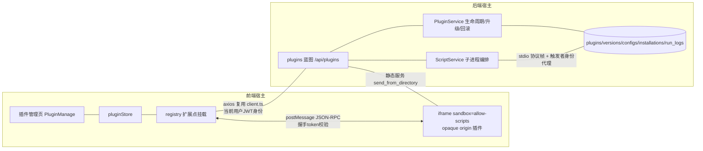

# SmartTable 插件体系架构设计

>  关联文档：[插件开发者指南](./developer-guide.html)

## 一、概述

### 1.1 目标

为 SmartTable 提供一套安全、可扩展的插件体系，使第三方开发者能够基于清晰的清单规范与 API 文档开发自定义插件，并通过安装包方式部署到已有系统中。

### 1.2 设计理念参照

| 参照系统 | 借鉴点 |
|---------|-------|
| 飞书多维表格插件 | 清单声明式注册、iframe 沙箱运行、宿主提供 SDK、安装时权限授权 |
| SeaTable Scripts | 后端脚本批量操作表格数据、脚本运行历史/日志、受限 API 代理 |

### 1.3 双形态插件

| 形态 | 运行位置 | UI | 通信方式 | 典型场景 |
|------|---------|----|---------|---------|
| `ui` 前端 UI 插件 | 浏览器 iframe 沙箱 | 有 | postMessage JSON-RPC | 面板、工具栏按钮、记录区块 |
| `script` 后端脚本插件 | 服务端受控子进程 | 无 | stdio 协议帧代理 | 批量数据处理、定时任务（预留） |

两种形态共用同一套清单规范、生命周期模型、权限模型与配置存储，仅在运行时机制上分叉。

### 1.4 总体架构



关键不变量：

1. **插件永不持有用户凭证**——所有数据操作由宿主代理执行并鉴权；
2. **插件是全局资源**——包文件全局共享，Base 级只存在安装/启用关系；
3. **有效启用 = 全局 status === enabled 且 plugin_installations.enabled === true**，前端 registry 仅挂载有效启用的插件。

---

## 二、插件清单规范（manifest.json）

### 2.1 完整字段定义

```json
{
  "id": "com.example.hello-panel",
  "name": "Hello Panel",
  "description": "示例插件",
  "icon": "icon.png",
  "author": { "name": "Example", "url": "https://example.com" },
  "version": "1.0.0",
  "type": "ui",
  "apiVersion": "1",
  "engines": { "smarttable": ">=1.7.0 <2.0.0" },
  "entry": "main.js",
  "permissions": {
    "records": "write",
    "tables": "read",
    "storage": true,
    "network": ["api.example.com"]
  },
  "extensionPoints": [
    { "type": "toolbar-button", "title": "Hello", "icon": "Star" },
    { "type": "side-panel", "title": "Hello Panel" }
  ],
  "configSchema": {
    "type": "object",
    "properties": { "greeting": { "type": "string", "default": "Hello" } }
  },
  "script": { "timeout": 60 }
}
```

### 2.2 字段说明

| 字段 | 必填 | 类型 | 说明 |
|------|-----|------|------|
| `id` | ✅ | string | 反向域名格式 `com.<org>.<name>`，全局唯一，安装后不可变更 |
| `name` | ✅ | string | 显示名（2-50 字符） |
| `description` | ❌ | string | 描述（≤500 字符） |
| `icon` | ❌ | string | 包内图标文件相对路径（png/svg，≤64KB） |
| `author` | ❌ | object | 作者信息 |
| `version` | ✅ | string | semver 格式 `MAJOR.MINOR.PATCH` |
| `type` | ✅ | enum | `ui` / `script` |
| `apiVersion` | ✅ | string | 宿主插件 API 大版本号，当前为 `"1"` |
| `engines` | ✅ | object | 宿主版本兼容范围（npm semver-range 语法） |
| `entry` | ✅ | string | 入口文件相对路径：ui 为 `.js`，script 为 `.py` |
| `permissions` | ✅ | object | 对象式分级权限声明（见 2.3） |
| `extensionPoints` | ui 必填 | array | UI 扩展点声明（见 2.4） |
| `configSchema` | ❌ | JSON Schema | 插件配置结构定义（Draft-07 子集） |
| `script.timeout` | script 可选 | number | 脚本超时秒数，默认 30，上限 300 |

### 2.3 权限声明（对象式分级）

```
permissions: {
  "records": "read" | "write",     // 记录读写
  "tables":  "read" | "write",     // 表结构读写（write 含创建/删除表）
  "storage": true,                 // 插件自有 KV 存储
  "config":  true,                 // 读取自身配置（隐含授予）
  "network": ["api.example.com"]   // 允许请求的域名白名单（首期宿主代理实现预留，文档级定义）
}
```

设计决策：采用**对象式分级**而非扁平字符串数组（如 `read:records`）。理由：未来引入细粒度权限（限定表/字段）时可在值上扩展（如 `{"records": {"level": "write", "tables": ["tbl_xxx"]}}`），扁平式届时是破坏性变更。未声明的权限点默认拒绝（deny by default）。

`config` 权限隐含授予：插件读取自身配置是基本能力，不需显式声明。

### 2.4 UI 扩展点类型（首期）

| type | 挂载位置 | 行为 |
|------|---------|------|
| `toolbar-button` | 表格视图工具栏 | 点击后打开 side-panel 或触发插件 |
| `side-panel` | 右侧 Drawer | 承载 iframe 沙箱渲染插件 UI |
| `base-menu` | Base 顶部扩展菜单 | 菜单项点击打开 side-panel |
| `record-detail-block` | 记录详情抽屉底部区块 | 承载 iframe 沙箱 |

扩展点为声明式注册，宿主按清单渲染，插件无需（也无法）直接操作宿主 DOM。

**勾选依赖声明**（可选，作用于该扩展点入口）：

| 字段 | 类型 | 说明 |
|------|------|------|
| `requiresSelection` | boolean | 为 `true` 时表格未勾选记录则宿主禁用入口并提示；保证插件拿到的 `selection` 非空 |
| `maxSelection` | number(1-1000) | 允许处理的最大勾选条数，超出时宿主禁用入口并提示，避免插件处理超大数据集 |

### 2.5 依赖管理范围声明

**首期不支持插件间依赖**（无 `dependencies` 字段），仅支持宿主版本兼容声明（`engines` + `apiVersion`）。理由：插件间依赖图解析、循环检测、安装顺序对首期过重；宿主 API 版本协商已覆盖核心兼容需求。未来扩展路径：manifest 增加 `dependencies: {"com.example.lib": ">=1.0.0"}` 字段，安装时拓扑排序，与本架构不冲突。

---

## 三、生命周期管理

### 3.1 状态机

```
                 upload(zip校验通过)
                        │
                        ▼
                  [installed] ──enable──▶ [enabled]
                        ▲                    │
                        └───disable──────────┤
                                             │ 连续失败 N 次
                                             ▼
                                          [error] ──re-enable──▶ [enabled]
                        任意状态 ──uninstall──▶ (删除)
```

全局状态（`plugins.status`）：`installed`（已安装未启用）/ `enabled` / `disabled` / `error`（连续运行失败自动置入，可手动恢复）。

### 3.2 操作与权限主体（两层 RBAC）

| 操作 | API | 权限主体 | 说明 |
|------|-----|---------|------|
| 上传安装/升级/回滚/卸载 | `POST /api/plugins/upload` 等 | **系统 Admin**（`User.is_admin`） | 插件包是全局资源 |
| 全局启用/禁用 | `PUT /api/plugins/<id>/status` | 系统 Admin | 全局停摆开关 |
| Base 级安装/启用/禁用 | `POST/PUT /api/plugins/<id>/installations` | **Base Owner/Admin**（`BaseMember.MemberRole`） | 每个独立决策。**仅对 UI 插件有功能语义**：installations 只用于 Base 分发挂载（registry `isEffective` + 沙箱加载 URL 校验）。脚本插件的运行由 RBAC + 全局启停控制，不消费 installations，管理页对其不提供 Base 安装入口 |
| 配置读写 | `GET/PUT /api/plugins/<id>/config` | Base Owner/Admin（base 级）/ 系统 Admin（global 级） | configSchema 校验 |
| 脚本手动运行 | `POST /api/plugins/<id>/run` | Base Editor 及以上（对该 Base） | 以触发者身份代理 |

全局 `disabled`/`error` 时，Base 级 `enabled` 无效——registry 只挂载"全局 enabled 且 Base 级 enabled"的插件。

**管理界面约定（实现与产品决策）**：上述全部管理操作的 **UI 入口集中在全局插件管理页**（`/admin/plugins`，`PluginManage.vue`）——上传、全局启停、**Base 级安装/启停/移除**（卡片"Base 安装状态"区块，按查询条件区所选 Base 操作）、两级配置（"配置"弹窗 global/base 页签）。**Base 编辑页面不提供任何插件安装/管理 UI**，仅消费"有效启用"的插件（registry 挂载）与运行入口；Base Owner/Admin 的 API 权限保持不变，仅 UI 呈现收敛到管理页。

### 3.3 安装流程

1. 上传 `.stplugin.zip`（multipart）；
2. 服务端解包校验：
   - zip 路径穿越防护（拒绝绝对路径、`..`、盘符前缀条目）；
   - zip bomb 防护：解压总大小 ≤ 50MB、文件数 ≤ 500、单文件压缩率异常检测；
   - `manifest.json` 存在且通过 jsonschema 校验；
   - `entry` 文件存在且在包内；
   - `version` 符合 semver；
   - `engines.smarttable` 与宿主版本（读 `version.json`）兼容；
   - `apiVersion` 为宿主支持的版本；
   - 扩展点/权限声明结构合法；
3. 计算包 checksum（sha256）；
4. 存储至 `uploads/plugins/<plugin_id>/<version>/`；
5. 写入 `plugins` + `plugin_versions` 表，状态 `installed`；
6. **启用与分发**（全部在插件管理页 UI 完成）：全局启用 → 在卡片"Base 安装状态"区块选择目标 Base 安装并启用 → 该 Base 页面 registry 挂载插件（UI 扩展点生效 / 脚本可运行）；UI 插件运行所需的 base/table 等参数由管理员在"配置"弹窗按 Base 作用域配置，Base 页面打开即用。

### 3.4 升级与回滚

- **升级**：上传同 `plugin_id` 更高版本 → 校验通过 → 新版本目录入 `plugin_versions`，更新 `plugins.current_version` 指针；**保留全部 configs / installations**（configSchema 若不兼容新配置结构，升级校验时拒绝安装并提示）；
- **回滚**：`POST /api/plugins/<id>/rollback` 指定 `plugin_versions` 中已保留的版本，切换 `plugins.current_version` 指针；旧版本目录始终保留（卸载时才清理）；
- **降级保护**：禁止上传低于当前版本号的包（回滚走专用 API，不走上传）。

### 3.5 卸载语义

卸载 = 全局删除：删除 `plugins`、全部 `plugin_versions`、全部 `plugin_configs`、全部 `plugin_installations`、`plugin_run_logs`（保留 30 天审计可改为软删除，首期硬删）+ 包文件目录。**禁用/升级不删数据**。

---

## 四、权限模型

### 4.1 模型组成

```
manifest 声明（申请） ──▶ 安装时授权人确认 ──▶ 运行时逐请求校验 ──▶ 越权拒绝+审计
```

1. **声明**：插件在 manifest 中静态声明所需权限，运行时不可动态申请（避免"钓鱼式"逐步提权）；
2. **授权**：系统 Admin 上传时看到权限摘要；Base Owner/Admin 在 Base 级启用时再次看到——两级授权人独立决策；
3. **校验**：宿主桥（前端 RPC 桥 / 后端 stdio 代理循环）对每个 method 调用逐一比对 manifest 权限；
4. **拒绝与审计**：越权调用返回 `PERMISSION_DENIED` 错误码并写入运行日志/审计日志（含 plugin_id、method、触发者）。

### 4.2 权限点与 API 方法映射

| 权限点 | 前端 RPC 方法 | 后端脚本 API |
|-------|--------------|-------------|
| `records: read` | `table.getRecords`, `table.searchRecords`, `table.getRecord` | `base.list_records()`, `base.get_record()` |
| `records: write` | `record.create`, `record.update`, `record.delete`, `record.batchUpdate` | `base.create_record()`, `base.update_record()`, `base.delete_record()` |
| `tables: read` | `table.getSchema`, `table.listTables` | `base.list_tables()`, `base.get_fields()` |
| `tables: write` | `table.addField`, `table.updateField`… | `base.add_field()`…（首期脚本侧可预留） |
| `storage` | `storage.get/set/remove` | `base.storage_get/set()`（独立于表格数据的插件 KV） |
| `config`（隐含） | `config.get` | `base.get_config()` |
| UI 能力（无需声明） | `ui.notify`, `ui.setPanelTitle` | — |

### 4.3 数据操作身份

- **UI 插件**：宿主以**当前用户** JWT 身份转发请求至现有 REST API——权限双重校验（插件权限点 + 用户 RBAC），用户无权的数据插件同样无权；
- **脚本插件**：宿主代理以**触发者身份**执行（手动运行 = 触发用户）；未来引入定时执行时，将增加"插件服务身份"（以 Base Owner 授权范围的降级只读/受限身份运行），该方案在本节预留。

### 4.4 审计归因

代理执行的数据变更，在变更历史/审计日志中附加 `via_plugin: <plugin_id>` 元数据，区分"人操作"与"插件操作"，保证批量操作可追责。

---

## 五、通信接口

### 5.1 前端：握手 + postMessage JSON-RPC

#### 5.1.1 沙箱隔离机制

iframe 以**同源 URL** `/api/plugins/<id>/versions/<version>/loader.html` 加载，但设置 `sandbox="allow-scripts"`（**不带** `allow-same-origin`）。效果：

- iframe 内容获得 **opaque origin**（`origin === "null"`），即使 URL 与宿主同源，也无法访问宿主 Cookie、localStorage、DOM；
- 未通过握手的 `postMessage` 一律丢弃。

**注意**：因 origin 恒为 `"null"`，**不能用 `event.origin` 白名单做来源校验**（开发环境 5173→5000 端口不同时同样为 null）。

#### 5.1.2 握手协议

```
宿主                                    iframe 插件
  │  创建 iframe，生成一次性 token          │
  │  URL: loader.html#token=<token>        │
  │  (fragment 不进服务器日志/Referer)      │
  │ ────────────────────────────────────▶ │
  │                                        │ 解析 fragment 得 token
  │ ◀──────── init { token } ───────────── │
  │  校验 token，按 (source window, token)  │
  │  绑定消息通道                           │
  │ ───────── initAck { sdk 版本, 权限集 }▶ │
  │                                        │
  │ ◀══════ rpc.request { id, method, params } ════│
  │ ══════ rpc.response { id, result | error } ▶│
```

token 为一次性 UUID，宿主侧维护 `(iframeWindow → pending token)` 映射，握手成功后销毁 token，防重放。

#### 5.1.3 RPC 消息格式

```json
// 请求
{ "type": "rpc.request", "id": "req-1", "method": "table.getRecords", "params": { "tableId": "tbl_x", "page": 1 } }
// 成功响应
{ "type": "rpc.response", "id": "req-1", "result": { "items": [], "total": 0 } }
// 错误响应
{ "type": "rpc.response", "id": "req-1", "error": { "code": "PERMISSION_DENIED", "message": "..." } }
```

错误码：`PERMISSION_DENIED` / `NOT_FOUND` / `VALIDATION_ERROR` / `RATE_LIMITED` / `MESSAGE_TOO_LARGE` / `INTERNAL_ERROR` / `API_VERSION_MISMATCH`。

#### 5.1.4 防护措施

- **速率限制**：每插件实例 50 req/s，超限返回 `RATE_LIMITED`；
- **消息大小**：单条 postMessage ≤ 256KB；
- **数据请求由宿主代理**：宿主桥调用 `api-surface`（复用前端 services/`client.ts`），插件不直接发 HTTP 请求（无 token 可用）；
- **loader.html 由后端静态路由动态生成**：注入 `window.SmartTableSDK`（握手、RPC 客户端封装、`sdk.ready(callback)`），插件 JS 为零构建 IIFE。

#### 5.1.5 事件订阅（预留）

协议预留 `rpc.subscribe(event)` / `rpc.unsubscribe(event)` 语义（如 `data.recordsChanged`），复用现有 WebSocket 实时推送链路转发。**首期不实现**，文档声明以避免第三方以轮询 hack。

### 5.2 后端：脚本沙箱 stdio 协议帧

#### 5.2.1 协议帧格式

子进程 stdout 每行一个 JSON 帧，协议帧与用户输出分离：

```
{"__rpc__": "call", "id": "c1", "method": "base.list_records", "params": {...}}   ← 脚本→宿主（代理调用）
{"__rpc__": "result", "id": "c1", "result": {...}}                                ← 宿主→脚本（经 stdin）
{"__rpc__": "log", "message": "处理了 100 条"}                                    ← 脚本日志（print 自动捕获转换）
{"__rpc__": "done", "status": "success", "result": {...}}                         ← 脚本结束
```

非协议帧（用户脚本直接写 stdout 的内容）由 runner 捕获并包装为 `log` 帧，避免污染协议通道。

#### 5.2.2 受限运行环境

复用并扩展现有 `app/script_runner/python_runner.py`：

- **受限 builtins**：移除 `open`/`exec`/`eval`/`__import__`/`compile`/`globals`/`locals`/`vars`/`input`/`breakpoint`/`exit`/`quit`；
- **模块白名单**：`json`/`re`/`math`/`datetime`/`decimal`/`collections`/`itertools`/`hashlib`/`base64`/`uuid`/`statistics`/`time`（仅时间读取）；
- **注入代理对象**：`base`（当前 Base 的受限表格 API）——每次方法调用经 stdout 协议帧回传宿主，宿主在 Flask app context 内以**触发者身份**执行（复用现有 service + 权限校验），结果经 stdin 回传；
- **print 捕获**：重定向 `sys.stdout`，print 内容包装为 `log` 帧。

#### 5.2.3 安全边界（诚实声明）

受限 builtins + 白名单 import 是**"受控执行"而非强沙箱**：Python 语言层面存在逃逸面（如 `().__class__.__bases__` 链）。纵深防御措施：

1. 子进程隔离（崩溃/超时不影响宿主）；
2. 超时（默认 30s，manifest 可声明上限封顶 300s）杀进程；
3. 输出体积限制（结果 ≤ 1MB、日志截断，复用现有 `script_execution_service` 常量）；
4. 并发子进程池上限（同时运行脚本数 ≤ CPU 核数，超限排队或拒绝）；
5. **生产部署建议**：以低权限 OS 用户运行后端子进程（运维文档说明）；
6. 脚本无网络访问能力（模块白名单不含网络库）。

#### 5.2.4 错误隔离

- 单次运行失败仅记录 `plugin_run_logs`（traceback 截断存储、复用日志脱敏规范）；
- 连续失败 N 次（默认 5）自动置全局 `error` 状态，前端提示可禁用/重试；
- 宿主侧代理循环运行在独立线程，异常不影响 HTTP 请求处理。

### 5.3 REST 管理接口（/api/plugins）

| 方法 | 路径 | 权限 | 说明 |
|------|------|------|------|
| POST | `/api/plugins/upload` | 系统 Admin | 上传安装/升级 zip |
| GET | `/api/plugins` | 登录用户 | 插件列表（含 Base 级状态过滤） |
| GET | `/api/plugins/<id>` | 登录用户 | 详情（含版本历史） |
| PUT | `/api/plugins/<id>/status` | 系统 Admin | 全局启用/禁用/恢复 |
| POST | `/api/plugins/<id>/rollback` | 系统 Admin | 回滚到指定版本 |
| DELETE | `/api/plugins/<id>` | 系统 Admin | 卸载 |
| GET | `/api/plugins/<id>/versions` | 登录用户 | 版本列表 |
| GET/PUT | `/api/plugins/<id>/config` | 见 3.2 | 配置读写（scope 参数） |
| GET | `/api/plugins/<id>/installations` | Base 成员 | Base 级安装状态 |
| POST/PUT/DELETE | `/api/plugins/<id>/installations` | Base Owner/Admin | Base 级安装/启停/移除（**仅 UI 插件**：POST/PUT 对脚本插件返回 400 `PLUGIN_TYPE_NOT_INSTALLABLE`；DELETE 保留用于清理存量关系） |
| POST | `/api/plugins/<id>/run` | Base Editor+ | 手动运行脚本插件 |
| GET | `/api/plugins/<id>/run-logs` | Base Owner/Admin | 运行日志 |
| GET | `/api/plugins/<id>/versions/<v>/loader.html` | 登录用户（会话） | UI 插件沙箱 loader |
| GET | `/api/plugins/<id>/versions/<v>/files/<path>` | 登录用户（会话） | 插件静态资源（send_from_directory 防穿越） |

REST 路径与静态文件路径用 `versions/<v>/files/` 前缀显式区分，避免 Flask 路由歧义。

### 5.4 沙箱渲染运行时（vendor）

插件 UI 允许直接用标准前端框架编写。宿主在 loader 中注入 **同源托管** 的渲染运行时，避免插件各自内联框架或依赖外网：

| 运行时 | 文件 | 注入方式 | 用途 |
|--------|------|---------|------|
| Vue 3 | `vue.global.prod.js`（含模板编译器） | loader 在插件入口脚本前加载 `vendor/vue.global.prod.js` | 插件可用 `Vue.createApp({ template })` 编写 UI |

要点：

1. **同源 + 离线可用**：vendor 由后端静态托管（`app/plugins_sandbox/vendor/`），不走 CDN，无需 `permissions.network`，内网/离线环境可用；
2. **安全边界**：文件名白名单（仅 `vue.global.js` / `vue.global.prod.js`）+ `send_from_directory` 防穿越；vendor 为只读静态资源，不参与握手鉴权；
3. **零构建**：插件仍为单个入口文件，模板以字符串书写，不要求打包工具链；
4. **CSP**：生产 CSP 的 `script-src` 已包含 `'unsafe-eval'`，满足 Vue 模板编译器（运行时编译）需求；
5. **隔离不变**：注入的 Vue 只存在于 opaque origin 的 iframe 内，与宿主页面的 Vue 实例完全隔离，不共享 DOM/状态；
6. **可扩展**：后续如需 React 等运行时，按同样的"白名单 vendor + loader 注入"方式加入即可，插件契约不变。

### 5.5 表格勾选数据通道（selection）

**目标**：用户在表格中勾选记录后，点击插件按钮即可把所选记录交给插件处理。

**数据通道（宿主 → 插件）**

| 环节 | 实现 | 位置 |
|------|------|------|
| 勾选状态出口 | 表格实现 `SelectionProvider { getSelection(): SelectionSummary }` 并注册；VTable 合并"行选择 + 复选框选择"去重输出，表头全选映射为当页全部行 | `VTableView.getSelection()` → `Base.vue` 注册 |
| 入口可用性 | 页面在 `records-select` 事件时上报勾选摘要（仅 ID + 计数），registry 维护 `selection`；工具栏按 `requiresSelection` / `maxSelection` 计算按钮 disabled 与提示 | `registry.setSelection` / `PluginToolbar` |
| 快照生成 | 打开插件（创建 RPC 桥）的**瞬间**生成一次快照并写入 bridge context，不随勾选变化推送 | `PluginSandbox` → `buildSelectionSnapshot()` |
| 插件读取 | `ui.getContext()` 返回 `selection`，或单独 `selection.get()` | `api-surface` |

**快照结构**：`{ recordIds: string[], total: number, truncated: boolean, selectAll: boolean, scope: "page" \| "view", at: number }`

**约束与完整性**

1. **只传 ID**：记录内容由插件按需 `table.getRecord` 拉取，避免批量数据进入沙箱上下文与 postMessage 通道；
2. **上限 1000**：超出截断并置 `truncated`（`total` 保留真实值），宿主与插件共同提示缩小范围；
3. **打开时快照**：不做变更推送，勾选变化需重新打开插件（可预测、无事件风暴）；后续如需实时化，可在通道上扩展 `selection.change` 事件而不破坏现有契约；
4. **失效清理**：表格刷新/删除记录后清理失效 ID；切换数据表时清空勾选，避免跨表串数据；
5. **权限**：selection 只暴露 ID，真正的读写仍走既有双层校验（manifest 权限点 + 用户 RBAC），勾选数据不构成越权通道。

**可扩展性与兼容性**

- 宿主侧表格适配通过 `SelectionProvider` 接口解耦：VTable 已接入，原生表格/其他组件库只需实现同一接口并注册；
- 插件侧只依赖全局 `SmartTableSDK`（postMessage + Promise），不绑定任何前端框架——Vue / React / 原生 JS 用法一致；
- 扩展点声明（`requiresSelection` / `maxSelection`）由后端 manifest schema 校验，非法声明在安装阶段即被拒绝。

---

## 六、插件配置存储

### 6.1 两级作用域

| 作用域 | 存储 | 写权限 | 用途 |
|-------|------|--------|------|
| `global` | `plugin_configs(scope=global)` | 系统 Admin | 全局默认参数 |
| `base` | `plugin_configs(scope=base, base_id=...)` | Base Owner/Admin | Base 覆盖参数（UI 入口：插件管理页"配置"弹窗 base 页签，按 Base 选择维护） |

读取规则：Base 级配置深合并于 global 级之上（Base 键覆盖同名 global 键）。

### 6.2 校验与迁移

- 写入时以 manifest `configSchema`（JSON Schema Draft-07 子集）校验；
- **升级保留**：configs 不随版本变化删除；若新版本 configSchema 与存量配置不兼容（校验失败），升级被拒绝并返回冲突详情。

### 6.3 插件自有 KV 存储

`storage` 权限授予插件独立的 KV 存储（`plugin_configs` 同表 scope 扩展或独立表，首期挂在 `plugin_storage` 键空间下，key 长度 ≤ 128，单值 ≤ 64KB，每插件总量 ≤ 1MB），与宿主数据隔离。

---

## 七、数据模型（Alembic 迁移）

```
plugins              全局插件记录
├── plugin_versions  版本历史（升级/回滚支撑）
├── plugin_configs   两级配置 + 插件 KV
├── plugin_installations  Base 级安装/启用关系
└── plugin_run_logs  脚本运行记录
```

| 表 | 关键字段 |
|----|---------|
| `plugins` | plugin_id(PK,字符串), name, description, icon, type, status, current_version, manifest(JSON), engines_text, created_at, updated_at |
| `plugin_versions` | id(PK), plugin_id(FK), version, package_path, checksum, installed_at |
| `plugin_configs` | id(PK), plugin_id(FK), scope(global/base/kv), base_id(可空FK), config_key, config(JSON), updated_by, updated_at |
| `plugin_installations` | id(PK), plugin_id(FK), base_id(FK), enabled, installed_by, installed_at；UNIQUE(plugin_id, base_id) |
| `plugin_run_logs` | id(PK), plugin_id(FK), base_id(FK), status, duration_ms, triggered_by, output(截断), error_summary, traceback(截断), created_at |

---

## 八、错误隔离与稳定性

| 层面 | 机制 |
|------|------|
| 前端插件 | iframe 加载失败/心跳超时（30s 无响应）仅销毁该插件挂载点，提示用户，不影响宿主页面 |
| 前端 RPC | 速率限制 + 消息大小限制 + 未识别消息丢弃 |
| 后端脚本 | 子进程超时杀进程；单次失败仅 RunLog；连续失败 N 次自动 error |
| 后端宿主 | 代理循环独立线程 + Flask app context；代理异常回传脚本 `INTERNAL_ERROR` |
| 资源 | 子进程并发上限；解包大小/文件数上限；RunLog/输出截断；日志脱敏 |
| 宿主 API 演进 | `apiVersion` 协商 + `engines` 范围检查，不兼容插件拒绝安装 |

---

## 九、版本管理

1. **插件自身版本**：semver，`plugin_versions` 保留全部历史，支持回滚；
2. **宿主版本兼容**：`engines.smarttable` 范围（宿主版本读 `version.json`），安装/升级时检查，宿主升级后存量插件不兼容时置 `disabled` 并提示（预留：启动时批量校验任务）；
3. **SDK/API 版本**：`apiVersion` 大版本协商，宿主支持多版本并存（v1 起步），破坏性变更升 major；
4. **降级保护**：上传低版本被拒绝，回滚走专用 API。

---

## 十、分发与插件市场（预留）

首期仅支持 `.stplugin.zip` 安装包上传。市场协议预留设计：

```json
// marketplace.json（市场 index，版本化 CDN 静态文件）
{
  "schemaVersion": 1,
  "updatedAt": "2026-09-07T00:00:00Z",
  "plugins": [
    {
      "id": "com.example.hello-panel",
      "name": "Hello Panel",
      "latestVersion": "1.2.0",
      "versions": {
        "1.2.0": { "url": "https://market.example.com/pkgs/hello-panel-1.2.0.stplugin.zip",
                    "sha256": "...", "publishedAt": "..." }
      },
      "publisher": { "id": "example", "verified": true },
      "signature": "<发布者对包 sha256 的签名，宿主用内置公钥验签>"
    }
  ]
}
```

未来接入市场时：宿主新增"浏览市场"页面 → 拉取 index → 下载包 → **走同一套上传校验流水线**（zip 防护/manifest 校验/engines 检查）+ 签名验签 → 安装。安装流水线完全复用，市场只是新的"包来源"。

---

## 十一、实施分期

| 阶段 | 内容 |
|------|------|
| P1（本次） | 清单规范、生命周期 API、双层 RBAC、前端 iframe 沙箱 + 握手 RPC、后端脚本沙箱、两级配置、管理页骨架、两个示例插件、开发者指南 |
| P2 | 事件订阅（rpc.subscribe）、网络权限代理（宿主代发白名单域名请求）、定时脚本触发与插件服务身份 |
| P3 | 插件市场（index 协议实现 + 签名验签 + 市场页面）、插件间依赖 |

---

## 十二、安全设计清单（Checklist）

- [x] iframe opaque origin 隔离（sandbox=allow-scripts，无 allow-same-origin）
- [x] RPC 握手 token（一次性、URL fragment 传递、防重放）
- [x] 权限逐请求校验 + deny by default
- [x] 插件永不持有用户凭证
- [x] zip 路径穿越 + zip bomb 防护
- [x] 静态服务 send_from_directory 防穿越
- [x] RPC 速率/消息大小限制
- [x] 脚本超时/输出/并发限制
- [x] 审计归因（via_plugin 元数据）
- [x] 日志脱敏（复用现有规范）
- [ ] 生产建议：低权限 OS 用户运行子进程（运维文档）
- [ ] 首期未覆盖：插件包签名（市场阶段引入）
